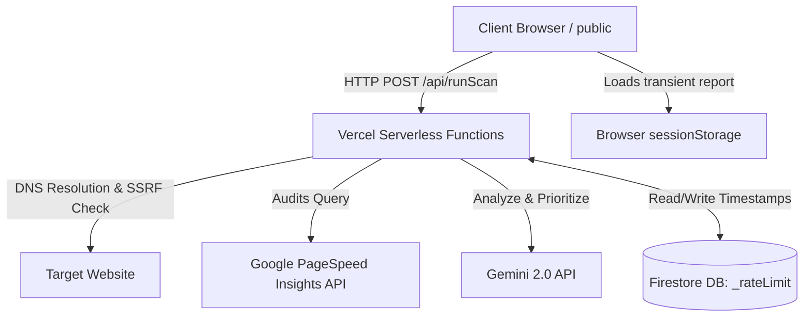

# LaunchShield 🛡️

LaunchShield is a free, no-login website audit tool that scans any public URL and gives you a clear health report in under 30 seconds.

It checks five things at once — Performance, SEO, Accessibility, Security, and Best Practices — and scores each one out of 100. Then it uses Gemini AI to turn those raw scores into plain-English action items, so you know exactly what to fix and in what order.

All of this works with **zero accounts or sign-ups required**.

---

## 🌟 Key Features

*   **5-Point Audits in Parallel**: Scans Performance, SEO, Accessibility, Security Headers, and Best Practices simultaneously in under 30 seconds.
*   **AI Diagnostics (Gemini 2.0)**: Automatically translates technical suggestions into clear, high-impact prioritized action cards. Falls back gracefully to rule-based recommendations if no API key is set.
*   **Defensive Security Hardening**: Evaluates critical response headers including HSTS, Content Security Policy (CSP), X-Frame-Options, X-Content-Type-Options, SSL validity, and mixed content issues.
*   **SSRF & Loopback Block**: Implements backend active DNS resolution and blocks loopbacks, link-local IPs, or private IP spaces to shield servers from Server-Side Request Forgery.
*   **Rate Limiting Protection**: Protects server resources using an IP-based sliding-window limiter (capped at **25 scans per 10 minutes**) backed by Firestore.
*   **No Accounts Needed**: Fully stateless on the frontend, storing report results in `sessionStorage` with no database footprint on the client side.
*   **Premium Visuals**: Features custom HSL-tailored dark modes, interactive 3D particle canvas overlays, score halos, animations, and PDF export.

---

## 🏗️ Architecture



*   **Frontend**: Static HTML5, CSS3 (Tailwind compiled), and vanilla JavaScript. No heavy JS frameworks required. Served by Vercel's global CDN.
*   **Backend**: Vercel Serverless Functions (Node.js 20) in the `api/` directory, orchestrating parallel calls to PageSpeed and Gemini APIs.
*   **Rate Limiter**: Firestore collection `_rateLimit` tracking transaction-wrapped IP base64 key arrays with a 24-hour TTL expiration. Accessed via `firebase-admin` SDK using service account credentials stored as a Vercel environment variable.

---

## 🚀 Deploying to Vercel (Free Tier)

### 1. Push to GitHub
```bash
git init
git add .
git commit -m "Initial commit"
git remote add origin https://github.com/YOUR_USERNAME/LaunchShield.git
git push -u origin main
```

### 2. Import to Vercel
1. Go to [vercel.com](https://vercel.com) and sign in.
2. Click **"Add New Project"** → **"Import Git Repository"**.
3. Select your `LaunchShield` repository.
4. Vercel will auto-detect the `vercel.json` config. **Do not change any settings.**
5. Click **"Deploy"**.

### 3. Add Environment Variables
After the first deploy, go to **Project → Settings → Environment Variables** and add:

| Variable | Required | Description |
|---|---|---|
| `FIREBASE_SERVICE_ACCOUNT` | ✅ Yes | Full JSON of your Firebase service account (for rate limiting). Paste as a single-line string. |
| `PAGESPEED_API_KEY` | Optional | Google PageSpeed Insights API key. Without it, deterministic mock scores are used. |
| `GEMINI_API_KEY` | Optional | Gemini AI key for real AI recommendations. Without it, rule-based recommendations are used. |
| `SCREENSHOT_API_KEY` | Optional | ScreenshotOne key (100 free/month). Without it, Microlink free fallback is used. |

> **How to set `FIREBASE_SERVICE_ACCOUNT`:** Copy the full content of your service account JSON file and paste it as the environment variable value. Vercel handles multi-line secrets correctly.

### 4. Redeploy
After adding environment variables, go to **Deployments → [latest] → Redeploy** to apply them.

---

## ⚙️ Local Development

### Prerequisites
*   [Node.js](https://nodejs.org/) (v20+)
*   [Vercel CLI](https://vercel.com/docs/cli) — `npm install -g vercel`

### Setup
```bash
# Install api/ dependencies
cd api
npm install
cd ..

# Create a local env file (copy from example)
cp .env.example .env.local
# Edit .env.local and fill in at minimum FIREBASE_SERVICE_ACCOUNT
```

### Run Locally
```bash
vercel dev
```
This starts a local server at `http://localhost:3000` that serves `public/` as static files and proxies `api/` as serverless functions — identical to the production environment.

---

## 🔒 Security Hardening

*   **Firestore Security Rules**: The client-side has zero authorization to read or write database collections directly (`allow read, write: if false;`). All database state mutations (rate limits) are handled exclusively on the backend via Firebase Admin SDK.
*   **Protocol Lock**: Only URLs matching `http:` or `https:` protocols are accepted.
*   **SSRF Shield**: Resolves target hosts to IPs using native DNS. If it resolves to any private address block (e.g. `127.0.0.1`, `10.0.0.0/8`, `192.168.0.0/16`), the scan is blocked immediately.
*   **API Secrets**: All API keys and the service account are stored exclusively as Vercel Environment Variables — never committed to the repository.

---

## 📁 Project Structure

```
LaunchShield/
├── api/                     ← Vercel Serverless Functions
│   ├── runScan.js           ← Main scan orchestrator (POST /api/runScan)
│   ├── package.json         ← API dependencies
│   └── lib/                 ← Shared modules
│       ├── pagespeed.js     ← PageSpeed Insights API wrapper
│       ├── htmlParser.js    ← HTML fetch & metadata extraction
│       ├── screenshot.js    ← Screenshot capture (keyless fallback chain)
│       ├── gemini.js        ← Gemini AI recommendations
│       └── rateLimit.js     ← IP-based rate limiter (Firestore)
├── public/                  ← Static frontend (served as CDN root)
│   ├── index.html           ← Landing page
│   ├── scan.html            ← Scanning progress page
│   ├── report.html          ← Audit report page
│   ├── css/                 ← Compiled Tailwind CSS
│   ├── js/                  ← Frontend JS modules
│   └── assets/              ← Logos, icons, images
├── functions/               ← Legacy Firebase Cloud Functions (not deployed)
├── .env.example             ← Template for environment variables
├── .gitignore               ← Protects secrets and node_modules
└── vercel.json              ← Vercel build & routing configuration
```
